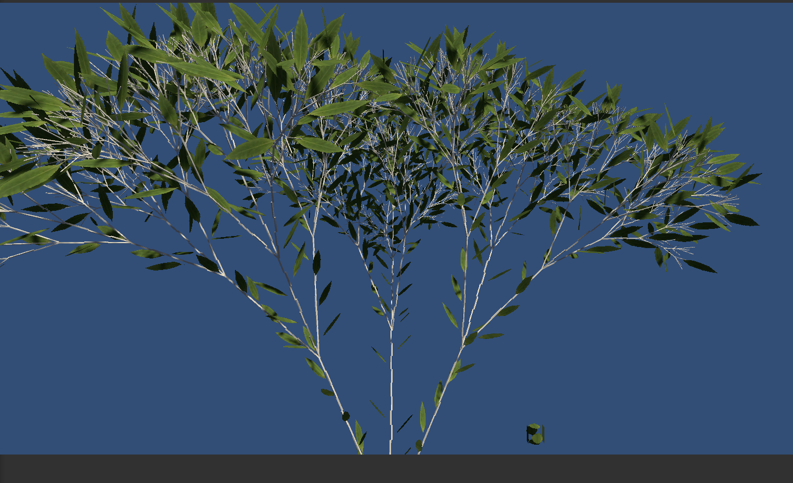
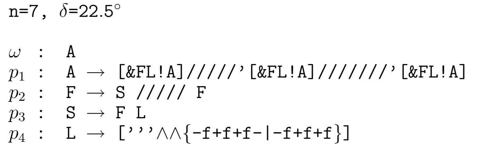

# LSystems
 L-System demo in unity

 Unity2020.3.22f1
 
 URP 10.7.0
 
| Scene | Image | Description | - |- |
| `development of Lychnis coronaria` |  | | 生长中的植被 |
| `s01-synthesis` |  | 合成体 |
| `s01-branching` |  | 分支结构 |
| `s01-branching1` |  | 分支结构 |
| `s01-branching2` |  | 分支结构 |
| `s02-bush-tree` |  | 灌木树、树叶、几何体构建 |
| `s02-plant-generated` |  | 植被成长、树叶、几何体构建 |
| `s04-parametric-lsystem` |  | 参数表达式 |
| `s05-modeling-tree` |  | 树木建模 |
| `s05-modeling-tree02` |  | 树木建模 |
| `s06-condition-lsystem-flower` |  | 条件表达式,花卉 |
| `s06-condition-lsystem-inflorescences` |  | 花卉花序 
| `Tree-leaf` |  | 树叶生成和着色 |    |
